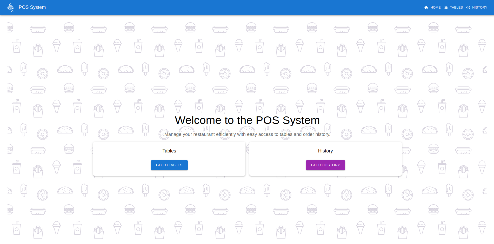
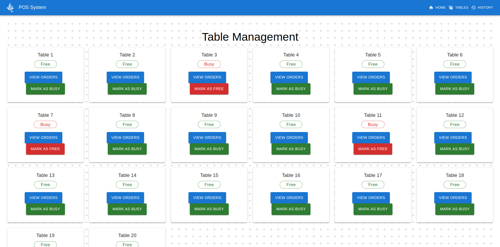
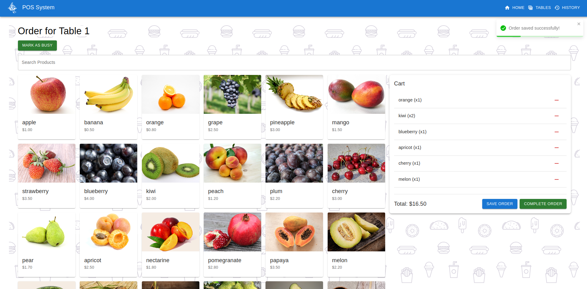
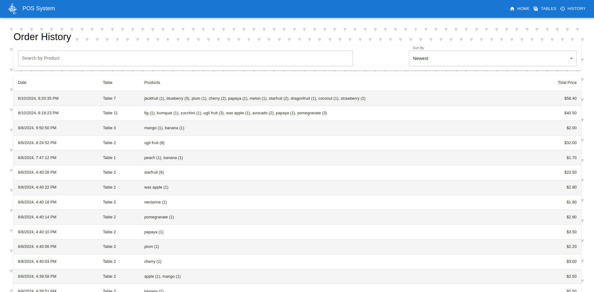
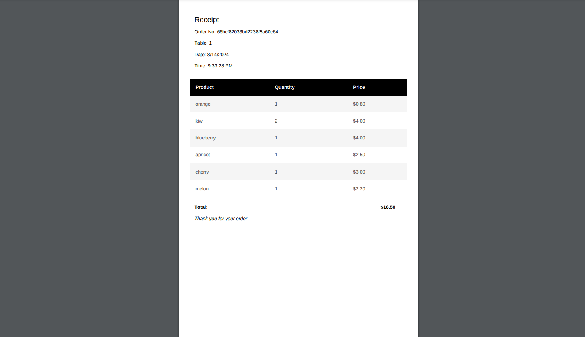

# Restaurant POS System


A comprehensive Point of Sale (POS) application designed specifically for restaurants. This system allows staff to manage tables, take orders efficiently, track order history, and generate receipts. Built with a modern tech stack featuring Node.js/Express for the backend, React/Material UI for the frontend, and MongoDB for data persistence.

**Project Repository:** [https://github.com/Mordris/RestaurantPOSapp](https://github.com/Mordris/RestaurantPOSapp)

## ✨ Key Features

- **Intuitive Table Management:** Visually track table availability (Free/Busy) and easily navigate between tables.
- **Efficient Order Taking:** Browse products, add items to a table's order cart, and view the running total.
- **Product Catalog:** Displays available menu items with images and prices. Includes a search feature for quick product lookup.
- **Order Persistence:** Save ongoing orders for tables that are not yet ready to pay.
- **Order Completion & History:** Complete orders, automatically moving them to a detailed history log and clearing the table's current order.
- **Searchable & Sortable History:** Review past orders, search by product name, and sort by date or total price.
- **Automatic PDF Receipts:** Generate and download a PDF receipt upon order completion, including order details, date/time, and total cost.
- **Responsive Design:** User interface built with Material UI, ensuring usability across different screen sizes.
- **Real-time Feedback:** Uses toast notifications for actions like saving or completing orders.

## 📸 Screenshots

1.  **Home Page:** Welcome screen with navigation options.
    

2.  **Tables View:** Grid showing all tables with their current status (Free/Busy).
    

3.  **Order Page:** View for a specific table, showing product grid, cart, total price, and order actions.
    

4.  **History Page:** Table displaying past orders with search and sort options.
    

5.  **PDF Receipt:** Example of a generated PDF receipt.
    

## 💻 Technology Stack

- **Backend:**
  - Node.js
  - Express.js
  - MongoDB (with Mongoose ODM)
  - `dotenv` for environment variables
  - `cors` for cross-origin requests
- **Frontend:**
  - React.js
  - React Router
  - Material UI (MUI) for UI components
  - Axios for API requests
  - `jsPDF` & `jspdf-autotable` for PDF generation
  - `react-toastify` for notifications
- **Database:**
  - MongoDB

## ⚙️ Prerequisites

Before you begin, ensure you have met the following requirements:

- Node.js (LTS version recommended)
- npm or yarn
- MongoDB instance (local or cloud-based like MongoDB Atlas)

## 🚀 Getting Started

Follow these steps to get the application running locally:

1.  **Clone the repository:**

    ```bash
    git clone https://github.com/Mordris/RestaurantPOSapp.git
    cd RestaurantPOSapp
    ```

2.  **Set up Backend:**

    - Navigate to the backend directory:
      ```bash
      cd backend
      ```
    - Install dependencies:
      ```bash
      npm install
      # or
      yarn install
      ```
    - Create a `.env` file in the `backend` directory (see Environment Variables section below).
    - Start the backend server:
      ```bash
      npm start
      # or
      yarn start
      ```
      The backend server will typically run on `http://localhost:5000` (or the port specified in your `.env`).

3.  **Set up Frontend:**
    - Navigate to the frontend directory (from the root):
      ```bash
      cd ../frontend
      # or if you are in backend: cd ../frontend
      ```
    - Install dependencies:
      ```bash
      npm install
      # or
      yarn install
      ```
    - Start the frontend development server:
      ```bash
      npm start
      # or
      yarn start
      ```
      The frontend application will open automatically in your default browser, usually at `http://localhost:3000`.

## dotenv Environment Variables

The backend requires a `.env` file for configuration. Create a file named `.env` in the `/backend` directory and add the following variables:

```env
# .env Example

# MongoDB Connection String
MONGODB_URI=mongodb://localhost:27017/restaurantPOS # Replace with your MongoDB connection string

# Server Port (Optional - defaults to 5000)
PORT=5000
```
